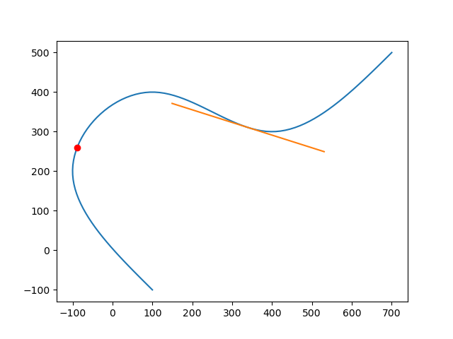

TinySpline
========


TinySpline is a small, yet powerful library for interpolating, transforming,
and querying arbitrary NURBS, B-Splines, and Bézier curves. The core of the
library is written in ANSI C (C89) with a C++ wrapper for an object-oriented
programming model. Based on the C++ wrapper, auto-generated bindings for C#, D,
Go, Java, Javascript, Lua, Octave, PHP, Python, R, and Ruby are provided.

### Table of Contents

- [License](#license)
- [Features](#features)
- [Installation](#installation)
  * [Pre-built Binaries](#pre-built-binaries)
  * [Compiling From Source](#compiling-from-source)
- [Getting Started](#getting-started)
- [Publications](#publications)
- [Theoretical Backgrounds](#theoretical-backgrounds)

### License
MIT License - see the LICENSE file in the source distribution.

### Features

- Object-oriented programming model
- B-Splines of any degree and dimensionality
- Spline interpolation
  - Cubic natural
  - Centripetal Catmull–Rom
- Evaluation
  - Knots
  - Sampling (multiple knots at once)
  - Equidistant points
  - Components (find y for given x)
- Reparametrization by arc length
  - Mapping length <--> knot
- Knot insertion (refinement)
- Sub-spline extraction
- Bézier curve decomposition
  - (also known as subdivision)
- Derivative
- Degree elevation
- Computation of rotation minimizing frames
- Morphing
- Serialization (JSON)
- Vector math

### Installation

#### Pre-built Binaries

Releases can be downloaded from the
[releases](https://github.com/msteinbeck/tinyspline/releases) page. In
addition, the following package manager are supported:

Conan (C/C++):  
https://conan.io/center/tinyspline

NuGet (C#):
```xml
<PackageReference Include="tinyspline" Version="0.5.0.1" />
```

Go:
```bash
go get github.com/tinyspline/go@v0.5.0
```

Luarocks (Lua):
```bash
luarocks install --server=https://tinyspline.github.io/lua tinyspline
```

Maven (Java):
```xml
<dependency>
   <groupId>org.tinyspline</groupId>
   <artifactId>tinyspline</artifactId>
   <version>0.5.0-1</version>
</dependency>
```

PyPI (Python):
```bash
python -m pip install tinyspline
```

On macOS, you probably need to change the path to Python in
`_tinysplinepython.so` via `install_name_tool`.

RubyGems (Ruby):
```bash
gem install tinyspline --pre
```

#### Compiling From Source

See [BUILD.md](BUILD.md).

### Getting Started

A variety of examples (tests) can be found in the [test](test)
subdirectory.

The following listing shows a Python example:

```python
from tinyspline import *
import matplotlib.pyplot as plt

spline = BSpline.interpolate_cubic_natural(
  [
     100, -100, # P1
    -100,  200, # P2
     100,  400, # P3
     400,  300, # P4
     700,  500  # P5
  ], 2) # <- dimensionality of the points

# Draw spline as polyline.
points = spline.sample(100)
x = points[0::2]
y = points[1::2]
plt.plot(x, y)

# Draw point at knot 0.3.
vec2 = spline.eval(0.3).result_vec2()
plt.plot(vec2.x, vec2.y, 'ro')

# Draw tangent at knot 0.7.
pos = spline(0.7).result_vec2() # operator () -> eval
der = spline.derive()(0.7).result_vec2().normalize() * 200
s = (pos - der)
t = (pos + der)
plt.plot([s.x, t.x], [s.y, t.y])

plt.show()
```
Result:



### Publications

If you use TinySpline in your research, please cite it as below.

```
@INPROCEEDINGS{Steinbeck:SANER:21,
  author =       {Steinbeck, Marcel and Koschke, Rainer},
  booktitle =    {2021 IEEE International Conference on Software
                  Analysis, Evolution and Reengineering (SANER)},
  title =        {TinySpline: A Small, yet Powerful Library for
                  Interpolating, Transforming, and Querying NURBS,
                  B-Splines, and Bézier Curves},
  year =         {2021},
  pages =        {572-576},
  doi =          {10.1109/SANER50967.2021.00068}
}
```

Other publications:

```
@INPROCEEDINGS{Steinbeck:VISSOFT:22,
  author =       {Steinbeck, Marcel and Koschke, Rainer},
  booktitle =    {2022 Working Conference on Software Visualization
                  (VISSOFT)},
  title =        {Edge Animation in Software Visualization},
  year =         {2022},
  pages =        {63-74},
  doi =          {10.1109/VISSOFT55257.2022.00015}
}
```

### Theoretical Backgrounds
[[1]](http://www.cs.mtu.edu/~shene/COURSES/cs3621/NOTES/spline/B-spline/bspline-curve.html)
is a very good starting point for B-Splines.

[[2]](http://www.cs.mtu.edu/~shene/COURSES/cs3621/NOTES/spline/B-spline/de-Boor.html)
explains De Boor's Algorithm and gives some pseudo code.

[[3]](http://www.codeproject.com/Articles/996281/NURBS-curve-made-easy)
provides a good overview of NURBS with some mathematical background.

[[4]](http://www.cs.mtu.edu/~shene/COURSES/cs3621/NOTES/spline/NURBS/NURBS-def.html)
is useful if you want to use NURBS in TinySpline.

